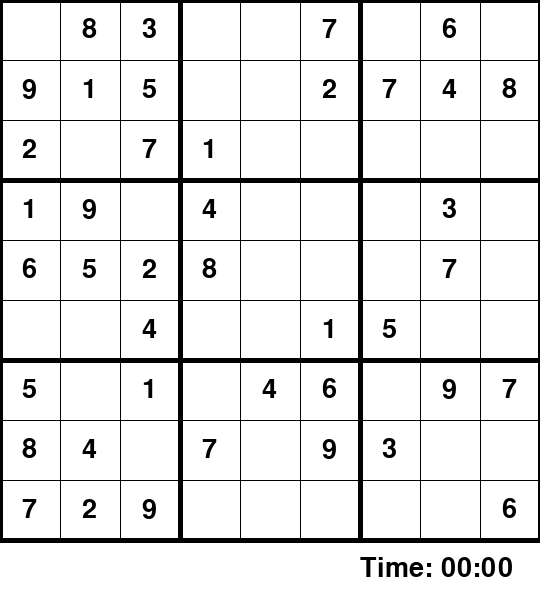

# Sudoku GUI Solver

A playable Sudoku desktop app backed by a backtracking solver and a puzzle generator that preserves a **unique solution** while removing clues.

## Demo



*Captured from the actual Pygame window while `GUI.main()` runs: select a cell, reject a wrong answer, pencil and clear a value, then complete the puzzle with keyboard input. The remaining correct entries are automated; this is not an automatic-solve feature in the UI.*

## Features

- backtracking Sudoku solver;
- randomized complete-board generation;
- puzzle generation with uniqueness checking;
- Pygame GUI with penciled values, strikes, and timer;
- immutable starting clues;
- deterministic generation support through a seed for testing.

## Run

```bash
python -m venv .venv
source .venv/bin/activate
pip install -r requirements.txt
python GUI.py
```

On Windows:

```powershell
.venv\\Scripts\\activate
```

## Controls

1. Click an empty square.
2. Press a number key to sketch a value.
3. Press Enter to commit it.
4. Delete/Backspace clears the sketch.

## Solver-only usage

```python
from Sudoku_Solver import generate_puzzle, solve_sudoku

puzzle, solution = generate_puzzle(level=40, seed=42)
solve_sudoku(puzzle)
assert puzzle == solution
```

## Test

```bash
python -m unittest -v
```

The tests verify solving, move validation, rejection of invalid boards, and unique-solution puzzle generation.

## Re-record the demo

```bash
pip install -r requirements.txt pillow
python scripts/generate_demo.py
```

The recorder runs the real GUI event loop with a reproducible generated puzzle, feeds mouse/key events, and captures the Pygame display surface. SDL's offscreen driver allows recording without a desktop. No board renderer or solver is duplicated. **Actions → Generate demo GIF** can refresh it manually.
